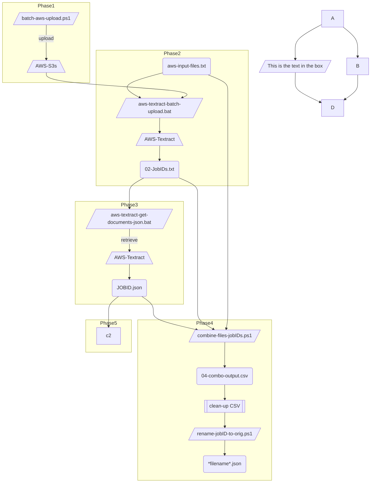

# aws-textract-ocr-pipeline
This repo is a collection of scripts that mimic &amp; extend functionality of AWS Textract Bulk Document Uploader. As of Oct'23, the Bulk Document Uploader has several limitations, including bulk download of files, that are addressed here.  

# Before we begin
This repo is a series of standalone scripts (.ps1, .bat, py) that leverage AWS Textract to submit lots of records in bulk & then derive the key text from those records. The scripts alternate between PowerShell & batch files. 
1. 



# Pre-requisites 
* ran from a windows machine
* python installed
* PowerShell with AWS
* AWS command

# Phase 1: Upload to S3
Assume you have a folder that contains many files in a flattend structure (no subfolders). 
```
aws s3 sync D:\path\to\flat_folder_name  s3://<bucket-name>/
```

check your work
```cmd
aws s3 ls  s3://<bucket-name>/  > s3_count.txt
```

# Phase 2: AWS Textract - Submit Files
* get-filenames.ps1
# Phase 3: AWS Textract -Retrieve Files
# Phase 4: Clean-up Files
# Phase 5: Get Raw Text

